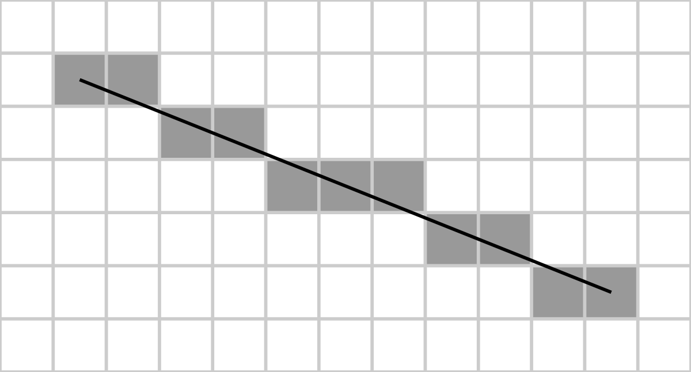
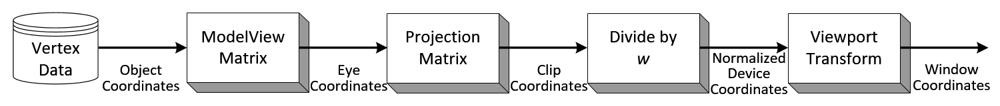

## 500 行 Python 写一个渲染器

### by 谭啸

---

## 实现步骤

+++

@snap[west span-50]
### 1, 2D平面上画点、线、三角形、填充三角形等
@snapend

@snap[east span-50]

@snapend


+++

@snap[north span-100]
#### Bresenham 画线算法
@snapend

@snap[west span-70]
```python
def draw_line(
    v1: Vec2d, v2: Vec2d, canvas: Canvas
):
    dots = []
    err = 0
    y = v1.y
    slope = abs((v1.y - v2.y) / (v1.x - v2.x))
    for x in range(v1.x, v2.x):
        dots.append(x, y)
        err += slope
        if abs(err) >= 0.5:
            y += 1
            err -= 1

    canvas.draw(dots)
```
@snapend

@snap[east span-30]

@snapend

+++

@snap[west span-50]
### 2, 空间坐标转换为平面坐标
@snapend

@snap[east span-50]

@snapend

+++

@snap[north span-100]
### 顶点变换
@snapend

@snap[west span-60]

@snapend

@snap[east span-40]

@snapend

@snap[south span-100]
图片来自：http://www.songho.ca/opengl/gl_transform.html
@snapend

+++
@snap[west span-50]
### 3, 简单的光照，z-buffer
@snapend


@snap[east span-50]

@snapend

+++


@snap[north span-100]
### 简单的光照
@snapend

@snap[west span-70]
```python
def get_light_intensity(face):
    light = Vec3d(-2, 4, -10)
    v1, v2, v3 = face
    up = normalize(cross_product(v2 - v1, v3 - v1))
    return dot_product(up, normalize(light))
```
@snapend


@snap[east span-30]

@snapend


+++
@snap[west span-50]
### 4,  纹理映射
@snapend

@snap[east span-50]

@snapend

---

## 经验

* 按图形学发展过程来做
* 每一步实现，看到反馈
* 找到正确的google关键词


---


## Github 地址

https://github.com/tvytlx/render-py
